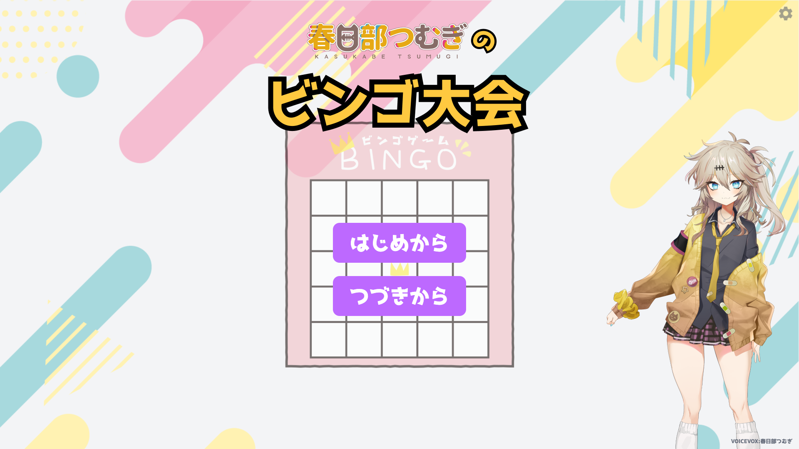
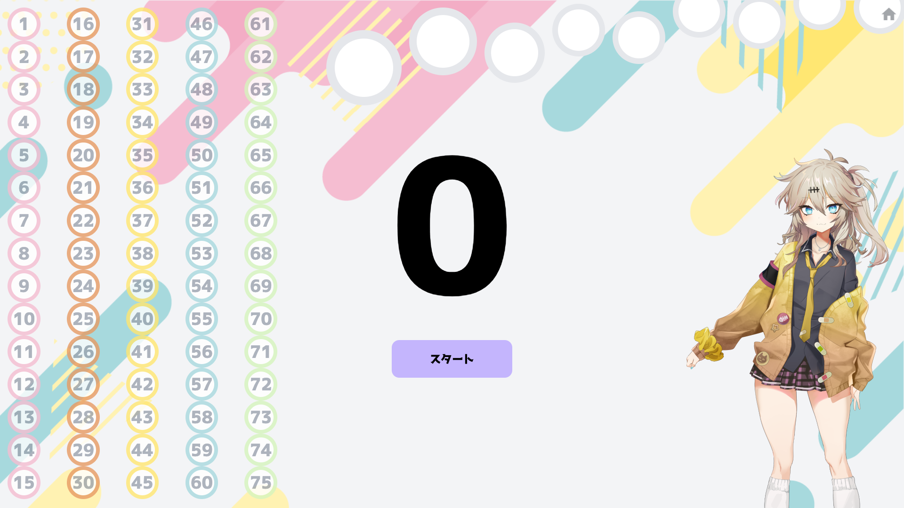
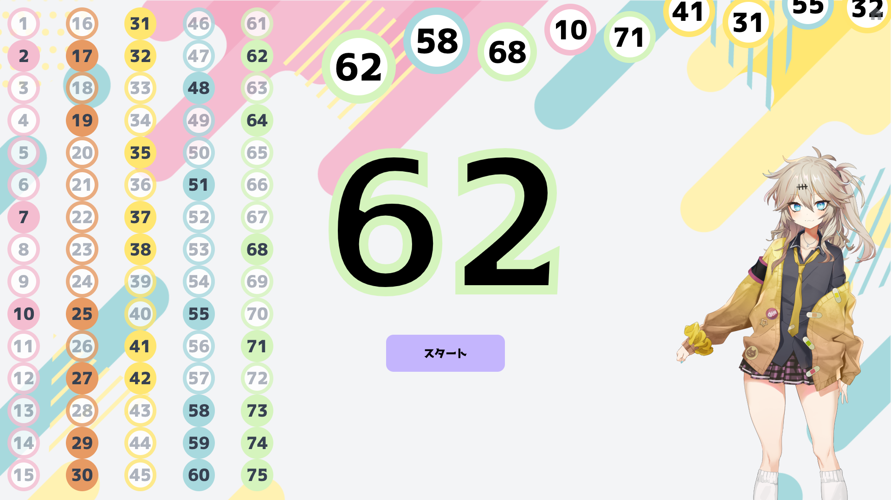

# 春日部つむぎのビンゴ大会

## 

---

## インストール

下記リンクからインストールするか、[パッケージ一覧](packages)から任意のバージョンおよび OS を選択してインストールしてください。

### Windows

> [1.0.0 をインストール](https://github.com/yuuumiravy/tsumugi-kasukabe-bingo/raw/main/packages/1.0.0/win/Bingo%20Setup%201.0.0.exe)

### Mac

> [1.0.0 をインストール](https://github.com/yuuumiravy/tsumugi-kasukabe-bingo/raw/main/packages/1.0.0/mac/Bingo-1.0.0.dmg)

※ Mac の場合、初回のアプリ起動時に、「開発元が未確認のため開けません」などのアラートが表示されることがあります。その場合は、アプリアイコンを右クリックし、「開く」を選択してください。

---

## もう全てのマスを探さない。

従来のビンゴアプリでありがちな「どの列の番号が当たったのかが分かりにくい」という問題を解消！
このアプリでは、ビンゴカードの 5 つの列ごとに色分けしました。これによって、いちいちすべてのマス目を確認する必要はありません！

## さっき当たった番号なんだっけ？を解消

直近に当たった番号を履歴として表示。もう隣の人にイヤな顔をされることもありません！

## 見て、聞いて、楽しいルーレット！

スタートボタンを押すと、ルーレットが回ります。さらに、春日部つむぎが声で番号を教えてくれます。

## 途中から再開

「パソコンが落ちてしまった！」といった時にもご安心ください。このアプリには、オートセーブ機能があります。ホーム画面の「つづきから」ボタンからはじめれば、再開できます。

もちろん、リセットして最初から始めたいという場合は、「はじめから」ボタンから始めることもできます。

